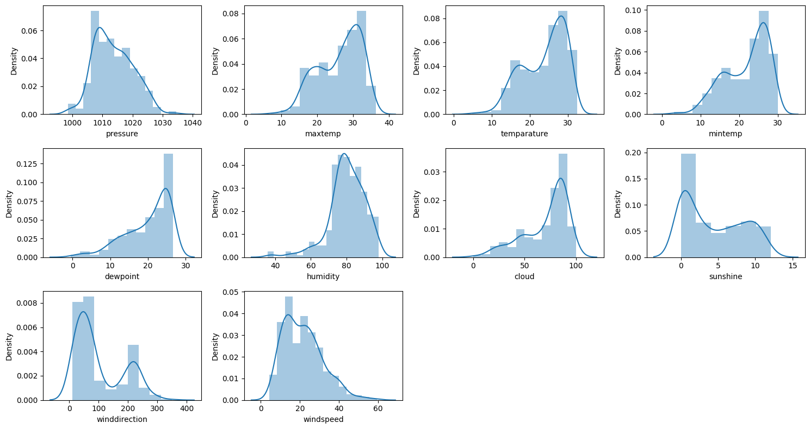
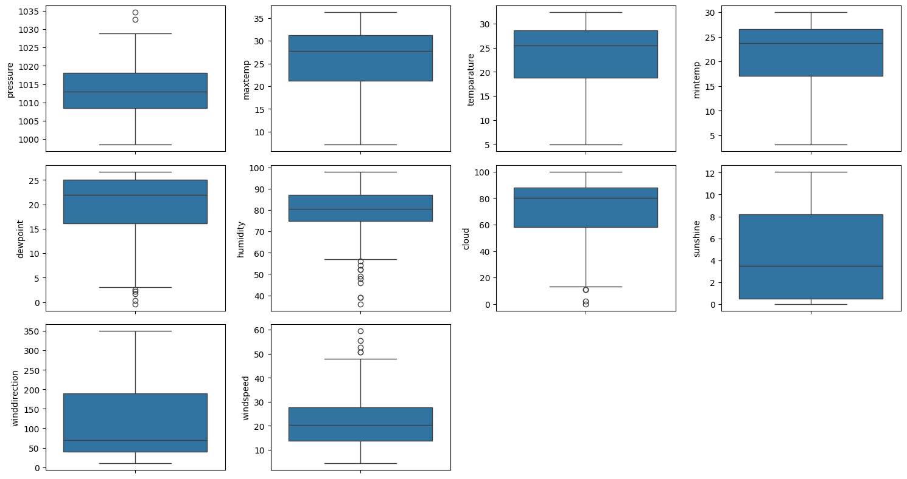
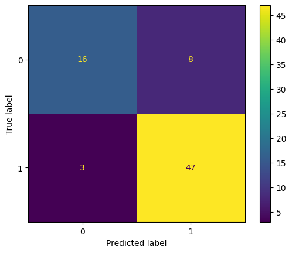

# 🌧️ Rainfall Prediction Using Machine Learning  
### Python | Machine Learning | Data Analysis

This project focuses on **predicting rainfall using machine learning techniques** based on historical weather data.  
It demonstrates the complete ML workflow including **data preprocessing, exploratory data analysis (EDA), model training, evaluation, and prediction**.

---

## 📌 Project Overview

Rainfall prediction is an important problem in meteorology and agriculture.  
In this project, machine learning models are trained on historical weather data to predict rainfall based on features such as:

- Temperature  
- Humidity  
- Wind Speed  
- Pressure  
- Past rainfall patterns  

The goal is to **analyze weather conditions and accurately predict rainfall occurrence**.

---

## 🎯 Objectives

- Understand and analyze historical weather data  
- Apply data preprocessing techniques  
- Perform Exploratory Data Analysis (EDA)  
- Train machine learning models for rainfall prediction  
- Evaluate model performance  
- Visualize insights and prediction results  

---

## 🧑‍💻 Technologies Used

- **Python**
- **Pandas**
- **NumPy**
- **Matplotlib**
- **Seaborn**
- **Scikit-learn**
- **Jupyter Notebook**

---

## 🧠 Machine Learning Workflow

1. Data Collection  
2. Data Cleaning & Preprocessing  
3. Exploratory Data Analysis (EDA)  
4. Feature Selection  
5. Train–Test Split  
6. Model Training  
7. Model Evaluation  
8. Prediction & Visualization  

---

## 📊 Output & Visualizations

### 🔹 Dataset Overview & Weather Patterns
This visualization shows the distribution and patterns of key weather features used in the dataset.



---

### 🔹 Feature Correlation Analysis
Correlation heatmap showing relationships between different weather parameters.



---

### 🔹 Rainfall Prediction Results
Final model prediction output illustrating rainfall classification or probability.



---

## 📈 Model Evaluation

The trained machine learning model is evaluated using the following metrics:

- Accuracy Score  
- Confusion Matrix  
- Precision  
- Recall  
- F1-Score  

These metrics help assess how well the model predicts rainfall events and handles class imbalance.

---

## ▶️ How to Run the Project

1. Clone the repository:
   ```bash
   git clone https://github.com/your-username/rainfall-prediction-ml.git
